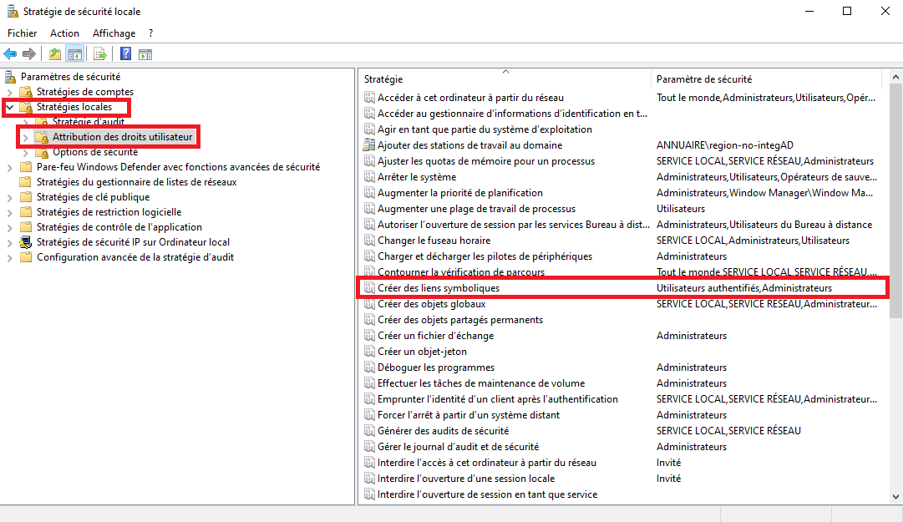
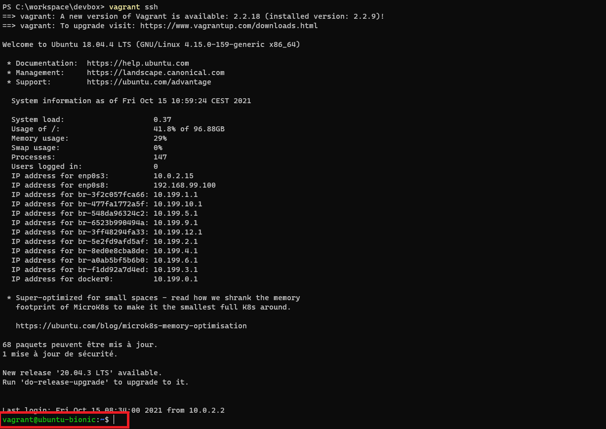
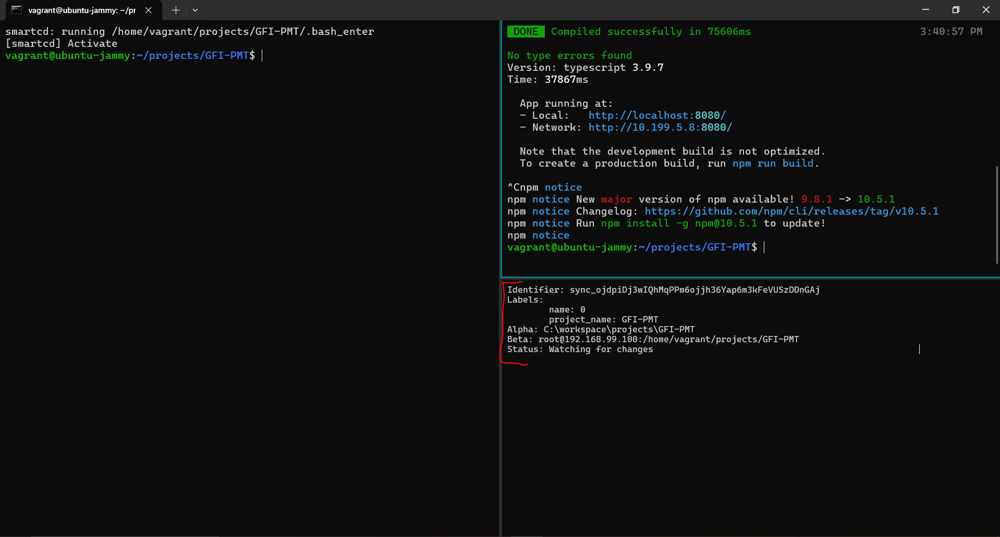
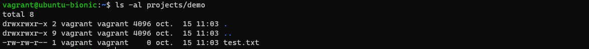
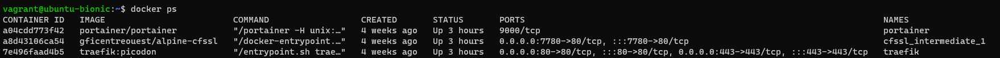
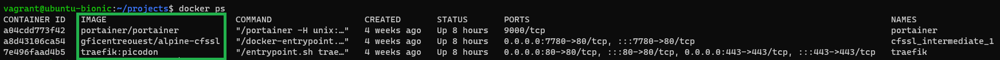

# Installation étape par étape

## Etape 1 : Organiser les répertoires de travail
- Privilégiez les disques SSD pour plus de de performances
- Créez les répertoires de la manière suivante, **pensez à adapter les chemins partout si vous n'utilisez pas ces valeurs par défaut** :

```
c:\workspace
c:\workspace\projects
```

## Etape 2 : Ajouter une permission de créer des liens symboliques

- Ouvrir l'application Stratégie de sécurité locale **en tant qu'administrateur** :
  `C:\ProgramData\Microsoft\Windows\Start Menu\Programs\Administrative Tools`
- Ajouter dans `Stratégies locale > Attribution des droits utilisateur > Créer des liens symboliques` le groupe utilisateur `Utilisateurs authentifiés` comme ci-dessous



## Etape 3 : Installer Virtualbox

- Installer la dernière version stable pour Windows de Virtualbox : `winget install Virtualbox` (dans une console ouverte en mode administrateur)
- Redémarrer le poste

## Etape 4 : Installer Vagrant

- Installer la dernière version stable pour Windows de Vagrant : `winget install Vagrant` (dans une console ouverte en mode administrateur)
- Ouvrez un autre terminal pour lancer les commandes suivantes (sinon, vagrant n'est pas connu après la première install)
- Installer les plugins Vagrant suivants :
  - `vagrant plugin install vagrant-certificates`
  - `vagrant plugin install vagrant-disksize`

Dans le cas de cette erreur : `ERROR:  You must add /C=US/O=Starfield Technologies, Inc./OU=Starfield Class 2 Certification Authority to your local trusted store
Vagrant failed to load a configured plugin source.`: Utilisez la commande 
```cmd
set SSL_CERT_FILE=C:\HashiCorp\Vagrant\embedded\cacert.pem
```
## Etape 5 : Installer Git for Windows

- Lancer la commande `winget install Git.Git` (dans une console ouverte en mode administrateur tant que le ticket : https://github.com/mutagen-io/mutagen/issues/491 n'est pas résolu)

## Etape 6 : Configurer Git

- Exécuter les commandes suivantes pour votre configuration globale Git, **dans un git bash**, pas forcément administrateur. Adaptez évidemment les noms...

```sh
git config --global --replace-all user.name "First Last"
git config --global --replace-all user.email "first.last@mail.com"
git config --global --replace-all pull.rebase true
git config --global --replace-all core.autocrlf false
git config --global --replace-all core.eol lf
git config --global --replace-all core.filemode false
git config --global --replace-all http.postBuffer 1000000000
git config --global --replace-all lfs.activitytimeout 60
git config --global --replace-all http.version HTTP/1.1
```
- Pour vérifier votre configuration Git globale : ```git config --list```

## Etape 7 : Installer Docker Devbox Vagrant

- Utiliser un terminal en étant placé dans ```c:\workspace```
- Cloner le repo github public du projet ```git clone https://github.com/inetum-orleans/docker-devbox-vagrant docker-devbox```
- Se placer dans le répertoire ```docker-devbox```
- Copier-coller le fichier ```config.example.yaml``` en le renommant ```config.yaml``` et adapter les valeurs en fonction du besoin.
Dans `env` vont se trouver des variables utilisées dans les scripts shell de provision de votre VM. Le tableau `provision_options` va servir à appeler des scripts supplémentaires présents dans `/provision/options`.

Par exemple, ici, les variables AZ_* nous servent à nous connecter au dépôt Azure d'images Docker d'Inetum. Nous ajoutons l'installation de git flow et azure cli directement dans la machine virtuelle via les scripts de provision optionnels.
```yml
env:
  AZ_USERNAME: username Azure
  AZ_PASSWORD: password Azure
  AZ_TENANT: tenant Azure
provision_options: ['git-flow', 'azure-cli']
```
*Pour les collaborateurs Inetum, vous pouvez trouver les variables d'environnement Azure dans la documentation Interne.*

Si vous avez mis en place un script additionnel, n'hésitez pas à contribuer via une Pull Request.

## Etape 8 : Créer une clé SSH

Pour vérifier l'existence d'un clé SSH, il faut vérifier la présence dans le profil utilisateur d'un répertoire `.ssh` contenant 2 fichiers `id_rsa` (clé privée) et `id_rsa.pub` (clé publique), **si aucune clé existe il faut en créer une** :

- Créer une clé SSH en ouvrant git bash (ou équivalent) et en lançant la commande `ssh-keygen -t rsa`
- L'ajout d'un mot de passe à la clé SSH n'est pas nécessaire

## Etape 9 : Installer Mutagen

- Se placer dans le dossier `c:\workspace`
- Créer un dossier `c:\workspace\mutagen`
- Créer un dossier `c:\workspace\mutagen\data`
- Télécharger Mutagen pour Windows x386 : https://github.com/mutagen-io/mutagen/releases/tag/v0.17.6
- Extraire le contenu de l'archive dans `c:\workspace\mutagen`

## Etape 10 : Configurer les variables d'environnement

- Créer la variable d'environnement suivante sur votre windows :

```
MUTAGEN_DATA_DIRECTORY=c:\workspace\mutagen\data
```

- Modifier la variable d'environnement `Path` pour inclure le chemin vers l'exe Mutagen `c:\workspace\mutagen`

## Etape 11 : Finaliser l'installation de Mutagen

- Exécuter les commandes suivantes

```sh
mutagen daemon start  # Start the daemon for this windows session
mutagen daemon register  # Start automatically on windows session startup
```

## Etape 12 : Provisionner la machine virtuelle

- Redémarrer votre poste
- Ouvrir un terminal en étant placé dans `c:\workspace\docker-devbox`
- Lancer la commande suivante (en tant qu'administrateur si c'est la première fois) : `vagrant up` (l'exécution de cette commande peut prendre plusieurs minutes, donc patience)

## Etape 13 (recommandée): Installer les scripts de lancement avec windows terminal
Suivre les instructions présentes dans le README du projet [devbox-scripts](https://github.com/inetum-orleans/devbox-scripts)

## Etape 14 : Valider le bon fonctionnement

### Valider la connexion SSH
- Ouvrir un terminal en étant placé dans `c:\workspace\docker-devbox`
- Lancer une des commandes suivantes : `vagrant ssh` ou `ssh vagrant@192.168.99.100` (raccourci qui gagne 5-10 secondes à l'exécution)
- Autoriser la connexion si demandé

La commande vagrant SSH permet de se connecter en SSH dans votre machine virtuelle



### Valider la synchronisation Mutagen
- Créer le dossier suivant `c:\workspace\projects\demo`
- Créer un fichier de test `c:\workspace\projects\demo\test.txt`
- Lancer le script `openWt.mjs` qui lui même va exécuter `mutagenStart.mjs`.

Une fois connecté à la machine, vérifier que Mutagen est bien lancé avec un Alpha et un Beta :



- Si vous n'avez pas installé les scripts de lancement alors lancez la commande suivante dans un terminal : 

````sh
mutagen sync create C:\\workspace\\projects\\demo root@192.168.99.100:/home/vagrant/projects/demo --sync-mode two-way-resolved --default-file-mode-beta 664 --default-directory-mode-beta 775 --default-owner-beta vagrant --default-group-beta vagrant
````

Une fois connecté à la machine, vérifier que Mutagen est bien lancé en effectuant la commande :
`mutagen sync list`

- Vérifier que le fichier test.txt est bien présent sur votre VM avec la commande `ls -al projects/demo`



### Valider le provisionning de votre VM
- Lancer la commande suivante : `docker ps`



## Etape 15 : Services disponibles dans votre machine virtuelle

La solution docker devbox met à disposition quelque soit le projet 3 services permettant de gérer certains aspects de tous vos projets :

- **Portainer** : solution de management Docker de vos images, containers, volumes, network, ...
- **Traefik** : solution de reverse proxy pour la prise en charge de DNS locaux pour l'accès à vos projets web
- **CloudFlareSSL** : solution de génération de certificat SSL

Cela se traduit par :

- 3 containers Docker toujours actifs sur votre machine virtuelle



Afin d'accéder aux IHM de certains de ces services, il faut renseigner au sein du fichier de hosts de Windows les éléments suivants :

```hosts
192.168.99.100 portainer.test
192.168.99.100 traefik.test
```

## Etape 16 : Installer et configurer Acrylic (optionnel)
[Guide d'installation d'Acrylic](../misc/Acrylic_config.fr.md)

## Etape 17 : Certificats SSL (optionnel)
Coming soon
