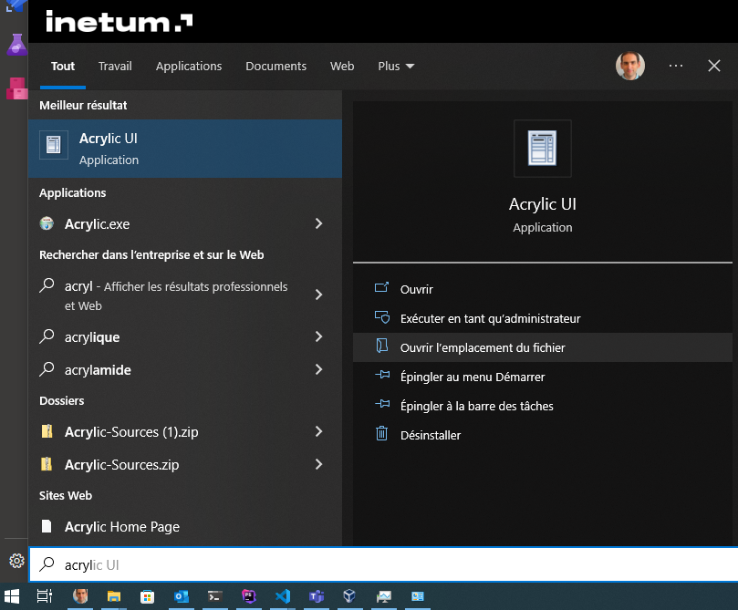
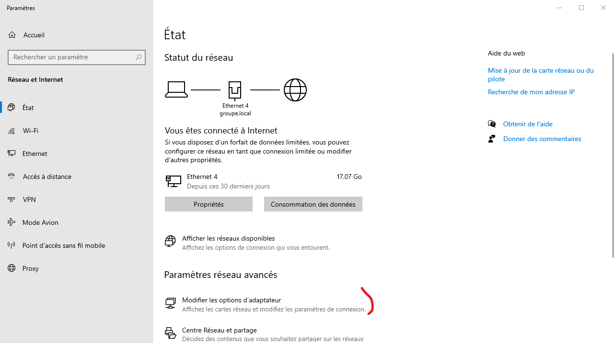
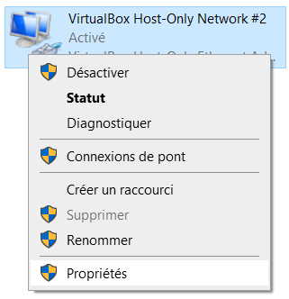
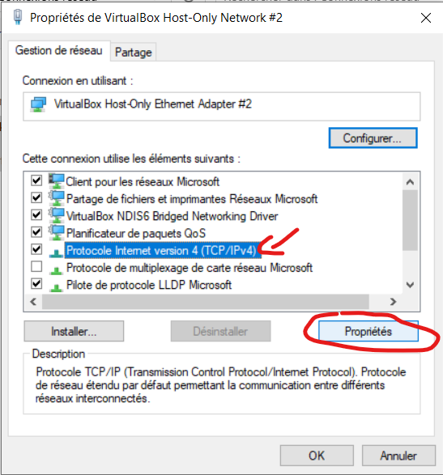
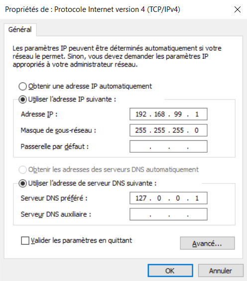
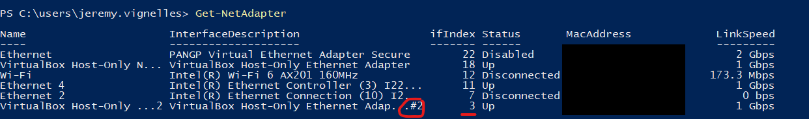

# Guide de configuration d'Acrylic
Une autre manière que d'adapter son fichier host existe pour résoudre les noms de domaine en `.test`.
Cette solution est appelée Acrylic qui est un résolveur de DNS local et qui a pour avantage de pouvoir rediriger d'un seul coup toutes les adresses en `.test` vers votre machine virtuelle.
## Installation d'Acrylic
Télécharger [Acrylic](https://mayakron.altervista.org/support/acrylic/Home.htm) setup for windows. Le logiciel étant un peu ancien, celui-ci peut déclencher des alertes de sécurité de la part de votre antivirus. Exécutez le programme en tant qu'administrateur afin de l'installer.

## Configurer Acrylic
Dans le menu démarer, chercher "Acrylic" et cliquer dans le panneau de droite sur "Ouvrir l'emplacement du fichier".

Dans l'explorateur qui s'est ouvert, ouvrir Acrylic UI avec vos droits administrateurs.

Cliquer sur "File"/"Open Acrylic Hosts".

Tout en bas du fichier, Ajouter la ligne:
`192.168.99.100 *.test`

Sauvegarder le fichier et accepter le redémarrage d'acrylic.

## Configurer l'interface "VirtualBox Host-Only Network #2" pour utiliser Acrylic
NOTE: il faut avoir créé la machine virtuelle avec vagrant up au moins une fois pour que l'interface réseau apparaîsse.
### Méthode graphique
Aller dans la configuration de la carte réseau en cliquant sur l'icône de réseau, dans la barre des tâches / paramètres réseau et internet.

Modifier les options d'adaptateur :

Sur la carte "VirtualBox Host-Only Network #2" (attention, il est censé y en avoir 2), clic droit/propriétés:

Sélectionnez "Protocole internet version 4" et faire "Propriétés":

L'adresse IP devrait déjà être configurée avec l'IP indiquée dans votre fichier config.yaml ou votre fichier vagrantfile. Si ce n'est pas le cas, vous vous êtes trompé(e) de carte réseau.

Saisissez 127.0.0.1 comme serveur DNS préféré :

Appuyez sur OK et sur Fermer.

Dans le navigateur, en tapant `traefik.test`, vous devriez avoir le dashboard de traefik.

### Méthode powershell (nécessaire pour les versions récentes de Windows 11)
Lancer un powershell en tant qu'administrateur.

Exécuter la commande `Get-NetAdapter` pour identifier la carte réseau. Noter son ifIndex pour le passer dans la commande suivante.

Définir sa configuration DNS avec la commande suivante : `Set-DnsClientServerAddress -InterfaceIndex 3 -ServerAddresses ("127.0.0.1")` où 3 est le numéro ifIndex trouvé plus haut.